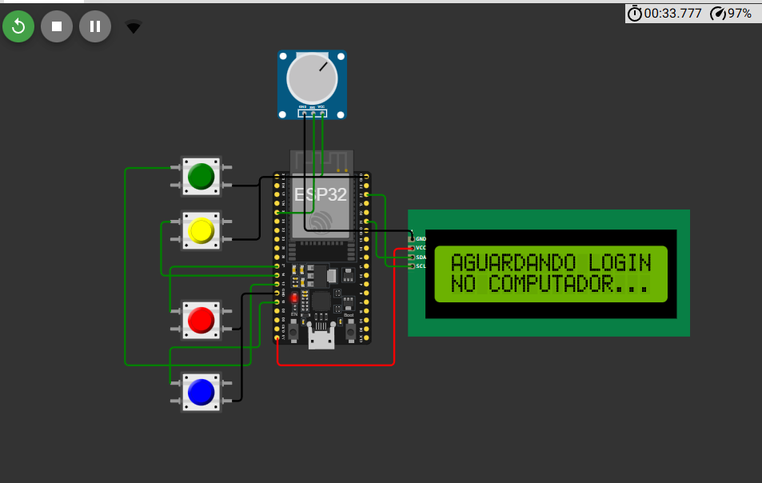

# 🚀 GS 2025 - IoT Upskilling Station: O Futuro do Trabalho

> **Global Solutions 2025 - Engenharia de Software / IoT**
> **Integrantes:** [Caio Freitas] - [RM553190]; [Enzzo Monteiro Barros Silva] - [RM552616]; [Lana Andrade] - [RM552596]

## 📝 Descrição do Projeto

O futuro do trabalho exige requalificação constante ("Upskilling") e um olhar mais humano para as competências socioemocionais ("Soft Skills").

A **Upskilling Station** é uma solução IoT desenvolvida para modernizar o processo de avaliação dos colaboradores e suas capacitações na empresa, buscando melhorar o conhecimento interno. Diferente de formulários estáticos e soluções rasas, nosso sistema utiliza uma estação física baseada em **ESP32** para capturar reações reais dos colaboradores diante de cenários de pressão, ética e desafios técnicos.

### 🎯 O Problema
Não sabemos sempre as capacitações dos funcionários, mas entender como o colaborador reage sob pressão ou qual é seu nível real de inteligência emocional e prontidão técnica irá melhorar nas escolhas de cursos de capacitação e melhorar o ambiente corporativo.

### 💡 A Solução
Uma estação de diagnóstico que combina:
1.  **Hardware IoT:** Medição de tempo de reação e nível de estresse (simulado) durante a tomada de decisão.
2.  **Dashboard em Tempo Real:** Um painel para gestores que utiliza gráficos de radar para mapear skills como "Engenharia de IA", "Empatia" e "Analytics".
3.  **Interatividade:** O sistema separa a visão do candidato (focada na tarefa) da visão do gestor (focada nos dados).

---

## 🛠️ Arquitetura e Tecnologias

O projeto utiliza uma arquitetura distribuída via protocolo **MQTT**, garantindo que o hardware e os dashboards web estejam sempre sincronizados, sem fios.

### Hardware (Simulado no Wokwi)
* **ESP32:** Microcontrolador principal (MicroPython).
* **LCD 16x2 (I2C):** Feedback visual imediato para o usuário.
* **4 Botões Físicos:** Seleção de respostas (A, B, C, D).
* **Potenciômetro:** Simulação de sensor biométrico (GSR/Nível de Estresse).

### 📡 Comunicação e Protocolos (MQTT)

O sistema utiliza um Broker público (`test.mosquitto.org`) e opera com trocas de mensagens JSON.

| Tópico MQTT | Tipo | Descrição | Exemplo de Payload |
| :--- | :--- | :--- | :--- |
| `fiap/gs2025/controle` | **Subscribe** | O ESP32 escuta este tópico para saber quando um candidato fez login no computador. | `{"acao": "INICIAR_TESTE", "nome": "Gabriel"}` |
| `fiap/gs2025/respostas` | **Publish** | O ESP32 envia dados da questão atual, respostas escolhidas e telemetria. | `{"tipo": "RESPOSTA", "pergunta": "1. Overfitting", "resposta": "A", "tempo_ms": 3400, "stress": 25}` |

---

## 🚀 Instruções de Uso

### 1. Hardware (Wokwi)
1.  Acesse o projeto no simulador: **https://wokwi.com/projects/447894206797080577**
2.  Certifique-se de que os arquivos `lcd_api.py` e `i2c_lcd.py` estão presentes na aba lateral.
3.  Inicie a simulação (Play). O sistema ficará em "AGUARDANDO LOGIN".

### 2. Interface Web (Dashboards)
1.  Abra o arquivo `dashboard/gestor.html` em uma aba do navegador. Ele ficará aguardando dados.
2.  Abra o arquivo `dashboard/candidato.html` em outra aba.
3.  Preencha nome e matrícula na tela do candidato e clique em **INICIAR**.

### 3. Execução
1.  O ESP32 receberá o comando e liberará a primeira pergunta.
2.  O texto completo aparecerá na tela do **Candidato**.
3.  Responda usando os botões físicos no Wokwi.
4.  Acompanhe o gráfico de radar sendo construído em tempo real na tela do **Gestor**.

---

## 📸 Circuito

---

## 📋 Requisitos Atendidos
- [x] Uso de ESP32 com MicroPython.
- [x] Sensores (Botões/Potenciômetro) e Atuadores (LCD).
- [x] Comunicação MQTT com envio de JSON.
- [x] Tema alinhado à Educação e Requalificação Profissional.
